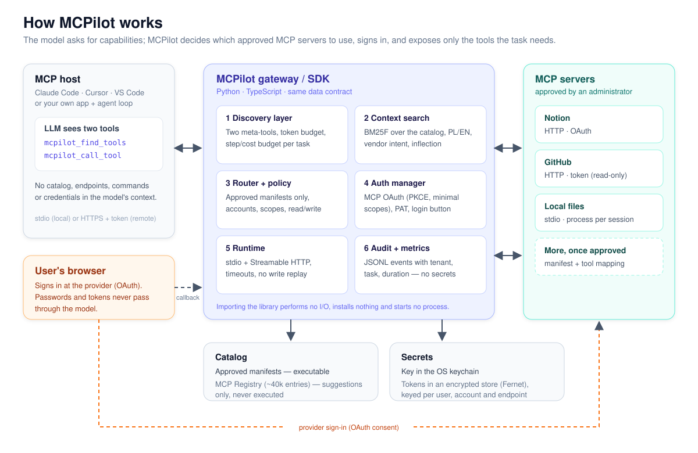
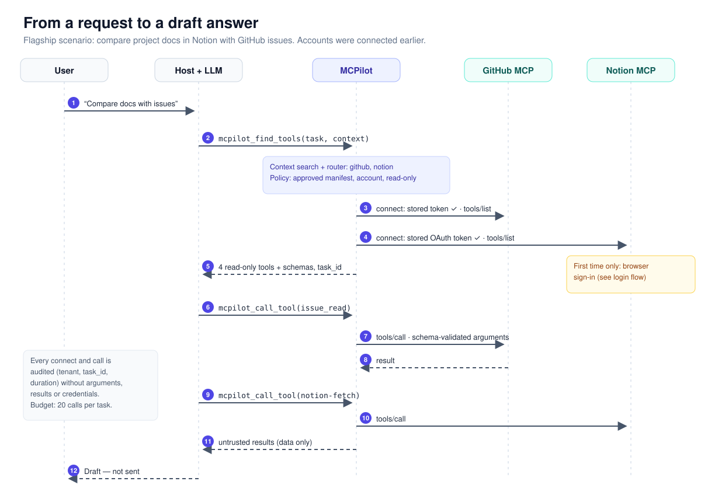
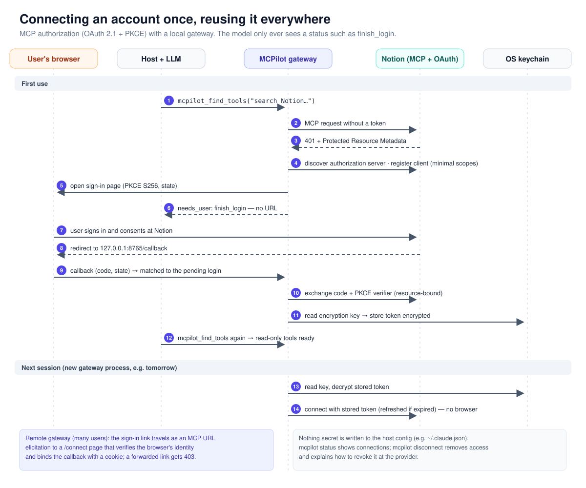
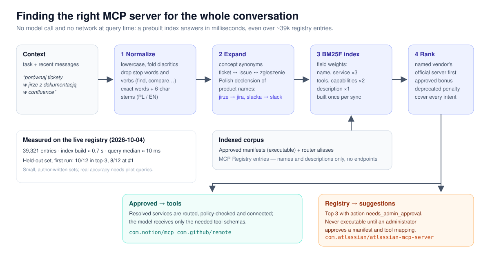

<div align="center">

# MCPilot

**Give your agent the right MCP tools for the task — not the whole catalog.**

MCPilot picks the approved [Model Context Protocol](https://modelcontextprotocol.io) servers a task needs,
signs the user in once, and exposes only the tools that task requires — with policy enforced in code.

[](https://github.com/Farfive/mcpilot/actions/workflows/ci.yml)


[How it works](#how-it-works) ·
[Quick start](#quick-start-claude-code) ·
[Finding the right MCP](#finding-the-right-mcp-for-the-conversation) ·
[Security](#security-model) ·
[Status](#project-status) ·
[Docs (Polish)](docs/README.pl.md)

</div>

---

> [!IMPORTANT]
> **MCPilot is a technical pilot, not a production service.** The protocol paths (MCP over stdio and
> Streamable HTTP, MCP OAuth with PKCE, durable workflows) are tested end to end with real servers on
> loopback and with Claude Code. **No run against real Notion or GitHub accounts has been recorded yet.**
> See [Project status](#project-status) for exactly what is verified and how.

## Why MCPilot

Connecting an LLM agent to MCP servers today means finding servers, copying install commands, editing
host config, pasting tokens, and loading every tool into the model's context. MCPilot turns that into:

1. The user states a goal: *“Compare the project docs in Notion with the open GitHub issues.”*
2. MCPilot works out which **approved** integrations the task needs and checks policy.
3. If an account is missing, the user gets a **sign-in button / browser page**. The model never sees tokens or login URLs.
4. The model receives **only the tools for this task**, validated and budgeted, and the task resumes.

It ships as an **async Python SDK**, a **TypeScript SDK** with the same data contract, and an optional
**MCP gateway** so existing hosts (Claude Code, Cursor, VS Code…) can use it through a single connection.

## How it works



| Component | What it does |
| --- | --- |
| **Discovery layer** | The model sees two meta-tools, `mcpilot_find_tools` and `mcpilot_call_tool`, instead of hundreds of tool schemas. Step and cost budgets apply per task. |
| **Context search** | A BM25F index over approved manifests and the MCP Registry maps the conversation to integrations (Polish and English, product-name inflection, vendor intent). |
| **Router + policy** | Only host-approved manifests, pinned by a SHA-256 fingerprint, can run. Accounts, capabilities, OAuth scopes and effects (`read`, `draft`, `write`, `send`) are enforced in code. |
| **Auth manager** | MCP authorization: protected-resource discovery, client registration, PKCE, minimal scopes, refresh, revoke. Also personal access tokens and API keys. |
| **Runtime** | MCP sessions over stdio (local processes) and Streamable HTTP (remote servers), with timeouts, health checks and clean shutdown. Uncertain writes are never replayed. |
| **Audit + metrics** | JSON Lines events with tenant, task, outcome and duration — never arguments, results or credentials. |

### From a request to an answer



### Connecting an account once



## Quick start (Claude Code)

The local gateway is verified with Claude Code. MCPilot is **not published to PyPI**: install from this
repository or from a CI artifact, and check its `SHA256SUMS`.

```sh
git clone https://github.com/Farfive/mcpilot.git && cd mcpilot
python3 -m venv .venv && source .venv/bin/activate
pip install -e '.[keychain]'

# Notion + GitHub (+ optional read-only local folder), registered in Claude Code
python -m mcpilot setup --github-pat-prompt --workspace ~/docs
```

`setup` keeps every secret out of the host configuration:

- **Encryption key** → OS keychain (macOS Keychain, Windows Credential Locker, Secret Service).
- **GitHub token** → encrypted store, typed into a hidden prompt (never a command-line argument).
- **Claude Code** → `claude mcp add` with no environment secrets. An existing entry is never overwritten.

Then, in Claude Code:

> *Find the project documentation in Notion and compare it with the open GitHub issues.*

The first use of Notion opens your browser to sign in. Later sessions reuse the stored access.

```sh
python -m mcpilot status              # what is connected (no tokens shown)
python -m mcpilot disconnect notion   # remove local access + how to revoke at the provider
python -m mcpilot uninstall --purge   # unregister and delete the keychain key
```

## Finding the right MCP for the conversation



When the router's built-in aliases do not name a service, `mcpilot_find_tools` searches the whole context.
You can pass `context` with the recent conversation. Matches split into two tiers:

- **Approved integrations** — connected and returned as tools.
- **Other MCP Registry servers** — returned as `suggestions` with `needs_admin_approval`. They carry no
  endpoint, package or command, so the model cannot run them. The local gateway adds the command the
  user can run to approve one (see below).

```sh
python -m mcpilot.search "compare jira tickets with the confluence docs" --cache registry-cache.json
python -m mcpilot.search --eval spec/search_eval_holdout.json --cache registry-cache.json --manifest approved.json
```

**Measured on the live registry (39,321 entries):**

| Metric | Result |
| --- | --- |
| Index build | ≈ 0.7 s |
| Query time (median) | ≈ 10 ms |
| Held-out queries, first run | 10/12 in the top three, 8/12 ranked first |

These sets are small and author-written; real accuracy will come from pilot queries. Details: [docs/search.md](docs/search.md).

## Approving any registry server

The model can suggest any of the ~38k active registry servers, but only a person can make one runnable:

```sh
python -m mcpilot approve com.atlassian/atlassian-mcp-server
```

1. MCPilot fetches the full registry entry and shows the publisher (official vendor namespace or a
   personal account), version, endpoint or package, and how sign-in works.
2. After you confirm, it connects once. If the server asks for a login, your browser opens.
3. It lists the server's tools. Only tools annotated `readOnlyHint` are mapped. Write tools need
   `--include-write` and a second typed confirmation.
4. On a second "yes", it writes a version-pinned manifest. The running gateway picks it up on the next
   search, with no host restart, and the conversation continues.

Approval needs a real terminal, so a model running commands in the background cannot approve
anything. Local packages need `--local` or `--container` plus a typed "run code on this computer"
consent. `python -m mcpilot remove <id>` withdraws access. Details: [docs/approval.md](docs/approval.md).

## Use it as a library

**Python**

```python
from mcpilot import MCPilot, Policy
from mcpilot.catalog import Catalog
from mcpilot.integrations import filesystem

files = filesystem("./examples/workspace")
policy = Policy([files], capabilities=["files.read"])

async with MCPilot(user_id="user-123", catalog=Catalog([files]), policy=policy) as pilot:
    toolset = await pilot.tools_for("Read the local README")        # only the tools this task needs
    reader = next(t for t in toolset.tools if t.name == "read_file")
    result = await pilot.call(reader.id, {"path": "README.md"})       # schema-validated, budgeted, audited
```

**TypeScript** (`ts/`, Node 20+, built on `@modelcontextprotocol/client`)

```ts
import { Catalog, MCPilot, Policy, parseIntegration } from "@mcpilot/sdk";

const notion = parseIntegration(manifestJson);   // same manifest JSON as Python
const pilot = new MCPilot({
  userId,
  catalog: new Catalog([notion]),
  policy: new Policy([notion], { capabilities: ["documents.search"] }),
});
const tools = await pilot.toolsFor("Find the project docs in Notion");
```

Public API: `discover`, `plan`, `connect`, `toolsFor` / `tools_for`, `call`, `status`, `disconnect`.

The library also includes:

- `WorkflowRunner` — durable multi-step tasks that resume after sign-in;
- `LoginBroker` — sign-in buttons and the host's callback route;
- `DiscoveryTools` — the two meta-tools for any agent loop;
- a LangChain adapter;
- a Claude agent example (`claude-opus-5-5`).

## Gateways

| Gateway | Transport | Users | Sign-in |
| --- | --- | --- | --- |
| Local — `python -m mcpilot.gateway` | stdio | one | browser + loopback callback |
| Remote — `"transport": "http"` | Streamable HTTP | many; JWT from your IdP, per-tenant policy | MCP URL elicitation to a `/connect` page that verifies the browser's identity |

The remote gateway isolates users and tenants. Each user gets their own sessions, processes and tool ids.
It also applies per-user rate limits and closes idle sessions. Configuration: [docs/gateway.md](docs/gateway.md).

## Security model

- **Registry data is never executable.** Only manifests approved by the host can run, and changing a manifest invalidates its approval.
- **Secrets stay out of the model, logs, errors and audit events.** Login URLs go only to the user's browser or host UI.
- **Least privilege.** OAuth scopes come from the capabilities in the plan. Scope escalation requires a policy change. Read-only is the default.
- **Untrusted output.** Tool descriptions and results are data, not instructions. Arguments and structured outputs are validated with JSON Schema.
- **Safe execution.** A write that times out is reported as `UncertainOutcome` and never retried automatically.
- **Hardened endpoints.** HTTPS and public addresses only, IANA special ranges blocked, no redirects. Legacy IPv4 forms and `*.localhost` are rejected.

Residual risks are documented in [SECURITY.md](SECURITY.md). For example, dependency isolation is not an OS sandbox.

## Project status

Every claim is labelled by evidence. The full list of 57 criteria with the tests that prove them is in
[docs/acceptance.md](docs/acceptance.md).

| Area | Status | Evidence |
| --- | --- | --- |
| stdio + Streamable HTTP, policy, budgets, no write replay | ✅ End to end, local | real MCP servers on loopback |
| Claude Code as host (stdio + HTTP gateway, `mcpilot setup`) | ✅ End to end, local | live runs with the real macOS Keychain ([docs/hosts.md](docs/hosts.md)) |
| Official GitHub MCP server tool names | ✅ Network | `github-mcp-server` v1.14.0 `tools/list` ([snapshot](spec/providers/github-mcp-server-1.14.0.json)) |
| MCP Registry sync, 40k entries, incremental | ✅ Network | live registry |
| Registry server → approval → gateway call (`mcpilot approve`) | ✅ Network | Microsoft Learn MCP from the live registry ([docs/approval.md](docs/approval.md)) |
| MCP OAuth (PKCE, DCR, refresh), sign-in button, URL elicitation | 🟡 Demonstrated | fixture identity provider, real protocol |
| Python ↔ TypeScript parity | ✅ End to end, local | shared vectors ([spec/vectors.json](spec/vectors.json)) |
| Notion and GitHub on real accounts | ⏳ Needs accounts | protocol runner ready: `python -m mcpilot.pilot` ([docs/pilots](docs/pilots/README.md)) |
| Cursor, VS Code | ⏳ Not verified | documented config only |
| Google Drive, Slack | ⏳ `setup_required` | provider OAuth apps and admin approval needed |
| Multi-instance gateway, KMS, monitoring | ❌ Not built | roadmap |

## Repository layout

```
src/mcpilot/      Python SDK: sdk, router, policy, catalog, auth, runtime, workflow,
                  discovery, search, approval, gateway (local), remote (multi-user), cli, pilot, metrics
ts/               TypeScript SDK (@mcpilot/sdk) with Node-only extras in @mcpilot/sdk/node
spec/             Cross-language vectors, provider tool snapshots, host evidence, search eval sets
tests/            pytest suite (106 tests) — real MCP servers over stdio/HTTP, OAuth fixtures
examples/         Flagship Notion + GitHub demo, OAuth demo, remote gateway demo, Claude agent
docs/             Architecture, auth, gateway, search, hosts, pilots, acceptance (Polish)
```

## Development

```sh
pip install -e '.[dev]'
scripts/ci.sh            # ruff, pytest, TypeScript tests against Python servers, build artifacts
```

CI runs Python 3.11–3.13 and Node 20/22, and builds wheel, sdist and npm tarballs with `SHA256SUMS`.

## Roadmap

1. **Pilot:** read-only Notion + GitHub on real accounts in Claude Code, using the recorded protocol reports.
2. **Remote gateway beyond one instance:** shared login state, a KMS/Vault `SecretStore`, metrics and tracing.
3. **Team features:** managed OAuth apps, an admin API for connections and approvals, audit export and retention.
4. **More integrations:** Google Drive and Slack once provider requirements are met; approval from the host window (MCP elicitation) in addition to the terminal.

## Documentation

Detailed docs are in Polish:

- [Architecture](docs/architecture.md)
- [Authorization](docs/auth.md)
- [Gateways](docs/gateway.md)
- [Search](docs/search.md)
- [Approving registry servers](docs/approval.md)
- [Hosts](docs/hosts.md)
- [Integrations](docs/integrations.md)
- [Pilots](docs/pilots/README.md)
- [Acceptance criteria](docs/acceptance.md)
- [Product and business model](docs/product.md)
- [TypeScript](docs/typescript.md)

## License

[MIT](LICENSE) © 2026 MCPilot contributors
